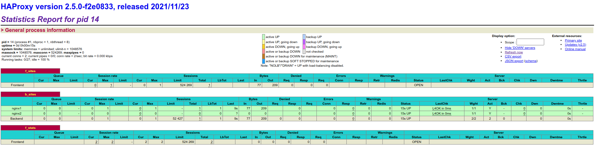
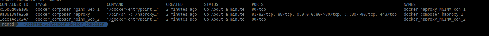
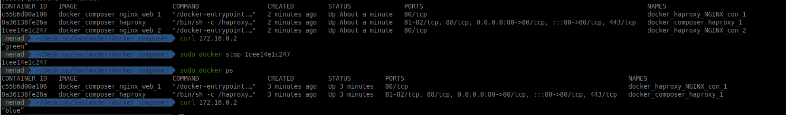
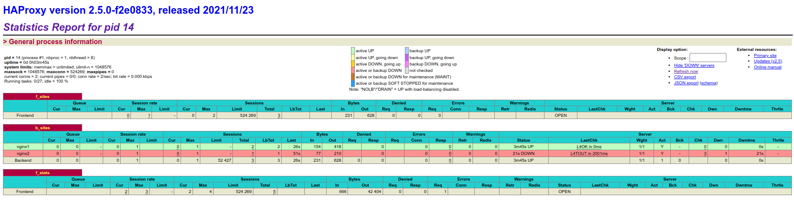

# Docker composer

# Installation steps:
 - Run the script (as sudo) from the main script “script.sh” file:

```sh
cd docker_composer
chmod a+x script.sh
./script.sh
```
 - The script will execute the docker-compose which will build and start the three servers.
 - Test the load balancer by executing some random curl commands on the HAProxy IP to check the response from both web servers

 ```sh
curl 172.16.0.2
```

 - Benchmark the web servers by sending a punch of requests directly:

 ```sh
ab -n 3000 -c 20 http://172.16.0.2/
```




